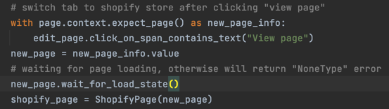

### How to setup project
run command to install requirements in project root

`pip install requirements.txt`

###  How to run project 
 run through run.sh file based in project root

`
pytest --headed --base-url https://page-builder.automizely.io tests/step_defs/test_product_detail_section.py --alluredir allure-results
`

**___command parameter___**

`--headed` start browser in headed mode

`--headless` start browser in headless mode, it's setted by default

`--browser {browser_name}` start specific browser, support **firefox**, **safari**, **chrome**, **chromium**(default browser)

`--base-url` specific testing environment base url

### How to debug
add `breakpoint()` into code and run project

### code snippet for some cases 
1. new page is created after clicking on an element, get the new page to interact with

2. enable force click when the normal click will be intercepted by the ancestor element
`page.click(selector, force=True)`